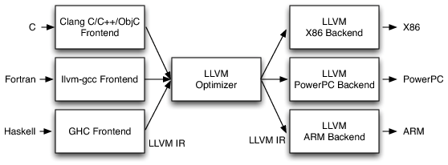
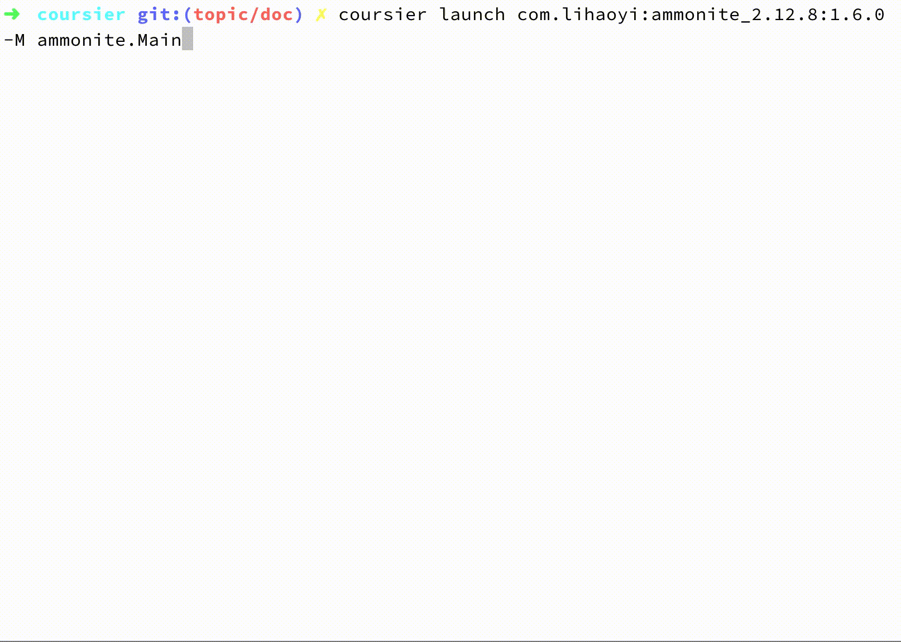
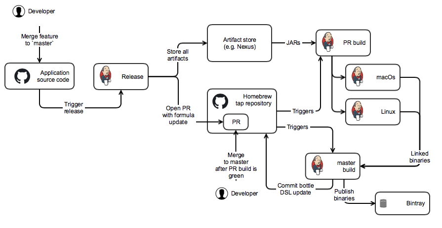

# Scala Native Workshop
-----
# Scala Native

> Scala Native is an optimizing ahead-of-time compiler and lightweight managed runtime designed specifically for Scala<br>
> _- scala-native.org_

Scala Native can take a Scala program with objects, traits, higher kinded types etc. and translate it down to the same the same kind of executable machine code that you would've got from a C compiler.

-----

# Scala Native

> Systems programming is the art of writing code while remaining aware of the properties and limitations of the machine that will run it.<br>
> _- Modern Systems Programming with Scala Native_

In addition, Scala Native adds powerful capabilities to work closer with the "bare metal"

* Elementary data types such as `struct`s, `pointer`s, low-level byte strings etc. are easy to work with. No need for `JNI` or `Unsafe`.
* Use system level shared libraries and C-style memory management
* Reuse existing tools and infrastructure in the Scala/Java ecosystem

Note: These techniques allows us to essentially replace C programs with Scala.

* Smaller memory footprint
* No JIT warmup phase at application startup
* Reuse the existing Scala and Java ecosystem
  * Build with SBT and publish to Maven Central as usual
  * Use ScalaTest and friends
    

-----

# In this workshop

* We're going to create a CLI that invokes remote HTTP APIs
* Package and distribute the application source code as well as pre-linked binaries

Note: Don't worry about what "pre-linked binaries" mean

-----

# Minimal setup

The officially supported way:
```
sbt new scala-native/scala-native.g8
```
but we have got something special:
```
git clone git@github.com:Tapad/scala-native-workshop.git
```
+
```
brew install llvm
brew install bdw-gc re2 # optional
```
-----

# Basic SBT commands
| | |
|-|-|
|compile	| Compile Scala code to NIR|
|run	    | Compile, link and run the generated binary|
|nativeLink	| Link NIR and generate native binary|

---

# Garbage Collection

## immix (default)

Immix is a mostly-precise mark-region tracing garbage collector.

## boehm

Conservative generational garbage collector.

## none (experimental)

Garbage collector that allocates things without ever freeing them.
Useful for short-running command-line applications or applications where garbage collections pauses are not acceptable.

---

## Is GraalVM a real threat to Scala Native?

Yes and no.

#### Scala Native key differentiators:

* low-level memory semantics, with elegant support to arrays, structs, and pointer arithmetic

* one can switch from close-to-metal code to idiomatic Scala seamlessly

* more suitable for systems programming glue-up code

-----

### Task 1 -- Getting started

In the cloned project run `sbt`, and `groll initial`.
Then,
```
sbt> run <your-name>
```

-----

### Task 2

```
sbt> groll next
```

Split the logic into library and application.
* Create a library with a function that generates a `greeting` for a given name.
* Build the binary, and run it outside of SBT.

### Worth looking

Check out intermediate representation in a `.nir` file.
NIR [docs](https://github.com/scala-native/scala-native/blob/master/docs/contrib/nir.rst).

-----

### Task 3

```
sbt> groll next
```

Parse CLI arguments.
* support toggle `--exclamation` which adds `!` after the greeting, and `name` to greet as the last parameter
* `--help` should print out a help message

### Hints

We can use regular Scala library (e.g. `scallop` in this case).

Normally in SBT, `%%` adds Scala version suffix (e.g. `_2.11`),

whereas `%%%` adds also Scala Native Version (e.g. `_0.3_2.11`).

-----

### Task 4

```
sbt> groll next
```

Add logging capabilities to your application.

The application should support running in a debug mode if `--debug` arguments is passed in.

### Hints

Consider [Slogging](https://github.com/jokade/slogging#scala-native) or your own solution.

-----

# Interoperability with C


---

### Basic memory management

```
Zone { implicit z =>
  val buffer = alloc[Byte](n)
}
```
or well-known `stdlib` and `libc` functions:
```
def malloc(size: CSize): Ptr[Byte]
```
```
def calloc(num: CSize, size: CSize): Ptr[Byte]
```
```
def realloc(ptr: Ptr[Byte], newSize: CSize): Ptr[Byte]
```
```
def free(ptr: Ptr[Byte]): Unit
```
```
def memcpy(dst: RawPtr, src: RawPtr, count: CSize): RawPtr
```

---

### Handling `String`s

```
def toCString(str: String)(implicit z: Zone): CString
```

```
def fromCString(cstr: CString,
                charset: Charset = Charset.defaultCharset()): String
```

---

### Extern objects and linking libraries

```
@native.link("mylib")
@native.extern
object mylib {
  def f(): Unit = native.extern
}
```

---

### Structs

```
type MyStructWith2Fields = CStruct2[CString, CString]
```

---

### Pointers:

| Operation	        | C syntax  |   Scala Syntax |
|-|-|-|
| As function argument | char* | Ptr[CChar] |
| Load value        | *ptr |	!ptr |
| Store value       | *ptr = value |	!ptr = value |
| Load at index     | ptr[i]	| ptr(i) |
| Store at index	| ptr[i] = value	| ptr(i) = value |
| Load a field      | ptr->name	| !ptr._N |
| Store a field     | ptr->name = value	| !ptr._N = value |

---

### Function pointers

the following signature in C:
```
void foo(void (* f)(char *));
```
can be declared as following:

```
def foo(f: CFunctionPtr1[CString, Unit]): Unit = native.extern
```

To pass a Scala function to CFunctionPtr1, you need to use the conversion function CFunctionPtr.fromFunction1():

```
def f(s: CString): Unit = ???
foo(CFunctionPtr.fromFunction1(f))
```

---

# For more details, go to the [documentation](http://www.scala-native.org/en/v0.3.8/user/interop.html#interop).

-----

### Task 5

```
sbt> groll next
```

Send a HTTP request to obtain your IP (e.g. `GET https://api.ipify.org`).

The application should print out the IP to standard output.

### Hints

The [com.tapad.curl.CCurl](curl/src/main/scala/com/tapad/curl/CCurl.scala) class
already contains a subset of functions exposed from [curl.h](https://github.com/curl/curl/blob/master/include/curl/curl.h).

Consider wrapping it up in a more convenient object.

C code examples for handling HTTP requests using curl can be found [here](https://curl.haxx.se/libcurl/c/example.html).

-----

### Task 6

```
sbt> groll next
```

Instead of using a one-off implementation of the Curl wrapper, consider using STTP.

### Goal

Send the request from task 5 using [STTP](https://github.com/softwaremill/sttp/blob/master/docs/backends/native/curl.rst).

Mind the note.

-----
# Linking

The first version of our application is now finished. Now we only need to link it do the target operating systems we plan to support and distribute it.

### Plan

* Link the application up-front to a set of operating systems and CPU architectures
* Distribute source code along with linked binaries through Homebrew

Note: I promised to explain "pre-linked binaries". Let's see what's happening under the hood. 

-----
# What _is_ Scala Native

* Scala Native is not a "native compiler"
* It's a "LLVM frontend"

-----

# LLVM Compiler Infrastructure

> Despite its name, LLVM has little to do with traditional virtual machines.<br>
> _- llvm.org_

* Umbrella term, not an acronym. LLVM is the name of the project
* It's a "closely knit" set of compilers, linkers, assemblers, debuggers, static analyzers etc. that works well together
* Can be used to compile various high level languages to various platforms, CPU architectures etc.  

-----

# LLVM overview

Multiple "frontends" are compiled to an intermediary representation (IR) which is processed by various "backends"



Note: This is not LLVM specific, all modern compilers looks like this

Compare with the JVM: Scala, Groovy, Jython etc.

Backends doesn't have to be AOT. Wide variety: There's also a JIT backend for IR, or you could compile C++ to Java Byte Code.

---
# LLVM and the JVM

* LLVM and the JVM are register and stack machines respectively
* LLVM IR is a much lower level representation than Java Byte Code
  * No garbage collection
  * No classes etc. in the intermediate representation\* 
* LLVM is more modular than the JVM, it support use cases such as
  * Compile Java code to native ARM or x86
  * Compile Haskell to PHP IR
* LLVM can perform AOT or compile to various intermediate formats
  * It also ships with its own JIT than runs on IR  
  
This is not good vs bad, it's just different approaches to producing assembly language

-----

# Terminology refresh

* What is an executable file, or "binary"?
* AOT and JIT compilers
* Intermediate representation (IR)
* Compiling vs linking applications
* Static and dynamic linking

Note:

Application: x86 + syscalls + executable file format (entry point, exit code, etc.)
AOT/JIT: Certain optimizations only possible in AOT and JIT respectively
Static & dynamic linking <=> Fat jars or not

-----
# Distribution plan

* `sbt package` produces JAR files with NIR files
* Publish JARs to Nexus as usual\*
* Make CI produce linked binaries and update formula with necessary code

\* In this workshop we're using localhost instead
-----
# 7 - Coursier

> Pure artifact fetching <br>+<br>JAR ⇒ Binary
 
* `Coursier` takes maven coordinates as input
* Integrates with Scala Native
* Can produce natively linked artifact as output



----- 
# 7 - Coursier

Use [coursier](https://github.com/coursier/coursier) to link a macOS or Linux binary from the application JARs. Add your coursier command to the supplied `Makefile`.

### Goal

* Run `make` to generate binary (hard coded version number is fine for now)

```bash
$ cd makefile/src/main/resources
$ make
$ ./tws wombat
Hello, wombat
Your IP is: 85.117.48.11
```
-----
# 8 - Homebrew 🍺

Homebrew is a package manager for Linux and macOS (and Windows through WSL)

We'll use homebrew to

* Ensure that dynamically linked libraries are available, install them if not
* Make pre-built binaries of our application available to our users

-----

## Homebrew terminology

* `Bottle`: Pre-built binary for a given OS and CPU architecture
* `Tap`: Git repository containing `Formulas`
* `Formula`: Package definition

See the complete list in the [Formula cookbook](https://docs.brew.sh/Formula-Cookbook)

---

Create a homebrew formula for the application. Fill out the missing parts of the formula at `homebrew/src/main/ruby/tws.rb`

### Goal

* Create a homebrew formula that runs the Makefile you created in the previous step 

```bash
$ sbt release
# Replace version number with what was released
$ brew install --build-from-source ~/.ivy2/local/com.tapad.workshop/homebrew/0.0.4/formulaes/tws.rb
```

-----
# 9 - Building bottles

So far we have what we need to assemble binaries for various platforms. Now we're going to to tie it all together.



---

## 9 - Building bottles

Create scripts that are run by CI on pull requests and master branch

* `pr.sh`: Should generate binary for the operating system it's run on
* `master.sh`: Should push binaries to Bintray and update Formula on master

### Goal

* Create a pre-linked binary for your operating system and surface it through homebrew

Homebrew should use the bottle when clients install the application

```bash
$ brew install tws
==> Installing tws from jgogstad/testtap
==> Downloading https://dl.bintray.com/jgogstad/bottles-testtap/tws-0.5.0.high_sierra.bottle.tar.gz
######################################################################## 100.0%
==> Pouring tws-0.5.0.high_sierra.bottle.tar.gz
🍺  /usr/local/Cellar/tws/0.5.0: 3 files, 7.3MB
$
```

-----

##### WITH *&#x2764;* FROM
# TAPAD Oslo!
